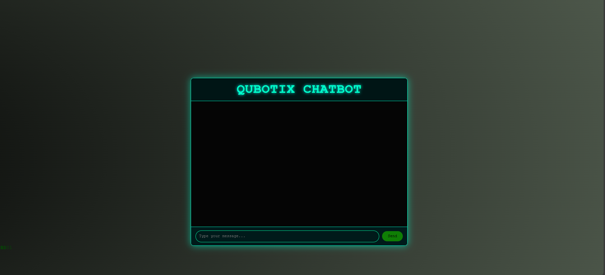

# -Qubotix-AI-Chatbot

# 🤖 Qubotix Chatbot – AI-Powered Hacker-Themed Web Chat Interface

Qubotix is a sleek, futuristic chatbot UI built with HTML, CSS, and JavaScript, powered by Google Gemini AI API. Designed with hacker aesthetics and animated cyberpunk vibes, this chatbot simulates human-like responses in a modern and engaging interface.

---

## 🚀 Features

- 🌐 Chat interface with real-time AI responses via **Gemini API**
- 🧠 AI-generated replies using natural language understanding
- 💻 Hacker-style animated background with binary rain
- 💬 Custom-designed user and bot chat bubbles with avatars
- 🎨 Fully responsive and styled with glowing techy gradients
- ✨ Smooth animations and modern UI design
- 🔐 Securely configurable API key

---

## 📸 Screenshot

  
> Hacker-inspired UI with glowing text, animated binary rain, and Gemini AI integration

---

## 🛠️ Tech Stack

- **HTML5** – Markup for layout and chatbot structure  
- **CSS3** – Advanced styling with animations and glowing effects  
- **JavaScript (Vanilla)** – Chat logic and API integration  
- **Google Gemini API** – AI model powering the chatbot

---

## ⚙️ Setup Instructions

1. **Clone the Repository**
   ```bash
   git clone https://github.com/yourusername/qubotix-chatbot.git
   cd qubotix-chatbot
  
